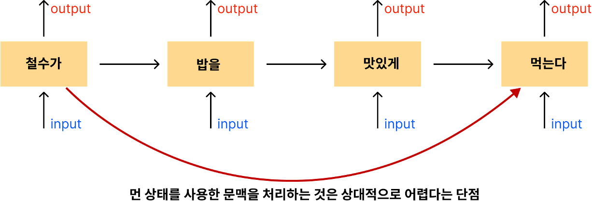
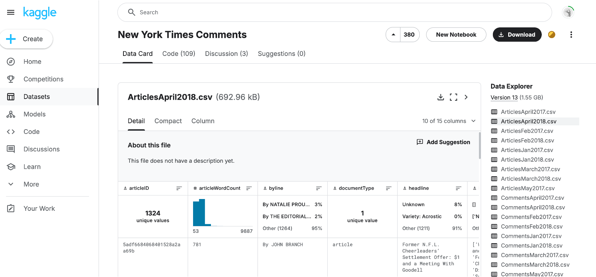
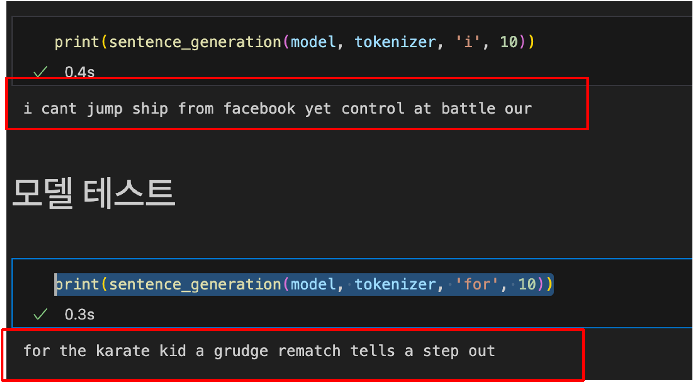
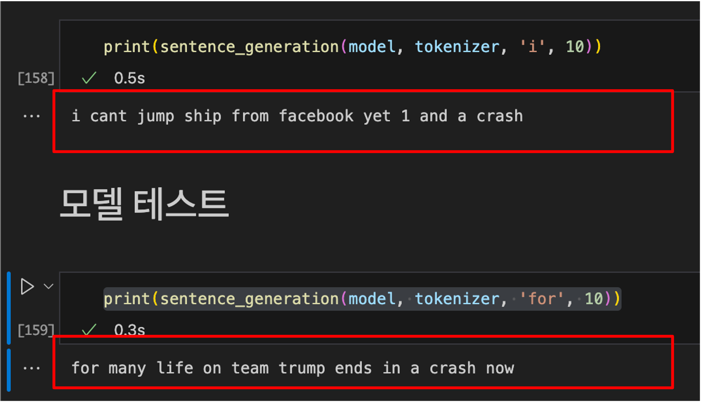

# 뉴욕타임즈 기사를 사용한 RNN 텍스트 생성
- 이 프로젝트는 뉴욕타임즈 기사의 제목을 사용해 순환 신경망(RNN) 모델을 구축하고, 텍스트 생성을 수행하는 예제입니다. 
- LSTM(Long Short-Term Memory) 구조를 활용하여 주어진 단어로부터 새로운 문장을 생성하는 것을 목표로 합니다.

## RNN이란? 
RNN (Recurrent Neural Network)은 시퀀스 데이터(연속적 데이터)를 다루는 데 특화된 신경망입니다. 
과거의 정보를 기억하고, 다음 데이터 처리에 반영할 수 있는 구조를 가지고 있습니다.
피드백 루프를 통해 이전 시간의 출력이 현재 입력으로 사용되는 형식입니다. 

시계열 데이터나 순서가 중요한 데이터에 적합하고 아래와 같은 예시로 사용될 수 있습니다. 
 자연어 처리(NLP): 번역, 감정 분석, 텍스트 생성
 음성 인식: 사람의 음성을 텍스트로 변환
 시계열 예측: 주식 가격 예측, 날씨 예보
 비디오 데이터 분석: 행동 인식, 장면 분석

### 장점 : 
- 순서나 맥락이 중요한 Sequence 데이터에 강합니다. 
과거 정보와 현재 정보를 연결할 수 있어, 문맥을 이해하거나 예측하는데 효과적입니다.
Ex) "철수가 밥을 맛있게 먹는다." 라는 문장이 있을 때, 이전 정보인  철수가 + 밥을 + 맛있게이라는 이전 정보를 통해 먹는다를 예측할 수 있습니다.

### 단점: 
장기 의존성 문제: 오래된 정보를 잘 기억하지 못합니다.
Ex) 철수가 와 먹는다 관계와 같이 현재 노드 위치와 먼 상태를 사용한 문맥을 처리하는 것은 상대적으로 어렵다는 단점이 있다.
기울기 소실/폭발 문제: 역전파 시 기울기가 사라지거나 너무 커지는 현상이 발생합니다.
계산이 복잡하고 학습 속도가 느릴 수 있습니다.

-------
## 데이터셋
데이터셋은 뉴욕타임즈의 기사 제목을 포함하고 있으며, 텍스트 생성 모델 학습을 위해 사용됩니다.(2018.csv 다운)

## Original Code
[위키독스](https://wikidocs.net/45101)
오리지널 코드로 실행했을때는 텍스트의 정확도가 떨어지는 현상 발생

## 수정
1. 더 큰 임베딩 차원 사용 
    : 현재 10으로 설정되어있는 embedding_dim 값을 10에서 더 큰 값(예: 50, 100 등)으로 늘려보는 것을 시도할 수 있습니다.
2. LSTM 레이어 추가
    : LSTM 레이어를 추가하면 모델이 더 복잡한 패턴을 학습할 수 있습니다.
3. 드롭아웃(Dropout) 추가
    : 드롭아웃을 추가해 과적합(overfitting)을 방지할 수 있습니다. 
4. 에포크 수 조정 및 학습률 튜닝
